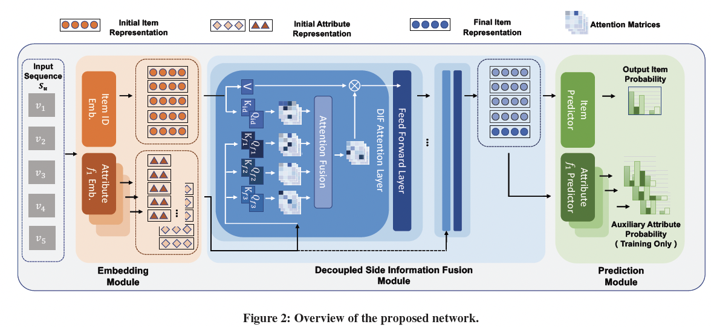

# DIF-SR
The source code for our SIGIR 2022 Paper [**"Decoupled Side Information Fusion for Sequential Recommendation"**](https://arxiv.org/abs/2204.11046)

## Overview
We propose DIF-SR to effectively fuse side information for SR via
moving side information from input to the attention layer, motivated
by the observation that early integration of side information and
item id in the input stage limits the representation power of attention
matrices and flexibility of learning gradient. Specifically, we present
a novel decoupled side information fusion attention mechanism,
which allows higher rank attention matrices and adaptive gradient
and thus enhances the learning of item representation. Auxiliary
attribute predictors are also utilized upon the final representation
in a multi-task training scheme to promote the interaction of side
information and item representation.



## Preparation

Our code is based on PyTorch 1.8.1 and runnable for both windows and ubuntu server. Required python packages:

> + numpy==1.20.3
> + scipy==1.6.3
> + torch==1.8.1
> + tensorboard==2.7.0


## Usage

Download datasets from [RecSysDatasets](https://github.com/RUCAIBox/RecSysDatasets) or their [Google Drive](https://drive.google.com/drive/folders/1ahiLmzU7cGRPXf5qGMqtAChte2eYp9gI). And put the files in `./dataset/` like the following.

```
$ tree
.
├── Amazon_Beauty
│   ├── Amazon_Beauty.inter
│   └── Amazon_Beauty.item
├── Amazon_Toys_and_Games
│   ├── Amazon_Toys_and_Games.inter
│   └── Amazon_Toys_and_Games.item
├── Amazon_Sports_and_Outdoors
│   ├── Amazon_Sports_and_Outdoors.inter
│   └── Amazon_Sports_and_Outdoors.item
└── yelp
    ├── README.md
    ├── yelp.inter
    ├── yelp.item
    └── yelp.user

```

Run `DIF.sh`.


## Reproduction
See _benchmarks_ folder to reproduce the results.
For example, we show the detailed reproduce steps for the results of DIF-SR on the Amazon Beauty dataset in DIF_Amazon_Beauty.md file.

Due to some stochastic factors, slightly tuning the hyper-parameters using grid search is necessary if you want to reproduce the performance. If you have any question, please issue the project or email us and we will reply you soon.

## Cite

If you find this repo useful, please cite
```
@inproceedings{Xie2022DIF,
  author    = {Yueqi Xie and
               Peilin Zhou and
               Sunghun Kim},
  title     = {Decoupled Side Information Fusion for Sequential Recommendation},
  book title= {International ACM SIGIR Conference on Research and Development in Information Retrieval (SIGIR)},
  year      = {2022}
}
```

## Credit
This repo is based on [RecBole](https://github.com/RUCAIBox/RecBole).

## Contact
Feel free to contact us if there is any question. (YueqiXIE, yxieay@connect.ust.hk; Peilin Zhou, zhoupalin@gmail.com; Russell KIM, russellkim@upstage.ai)
